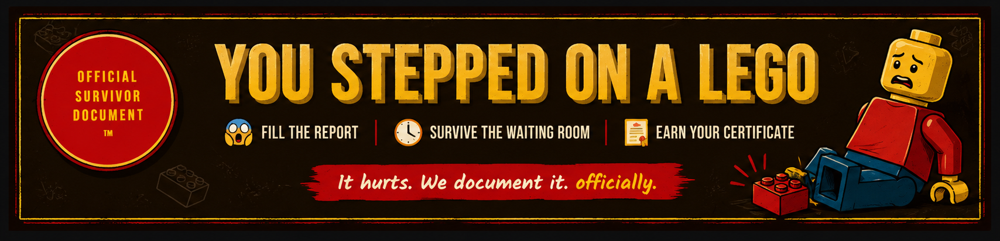
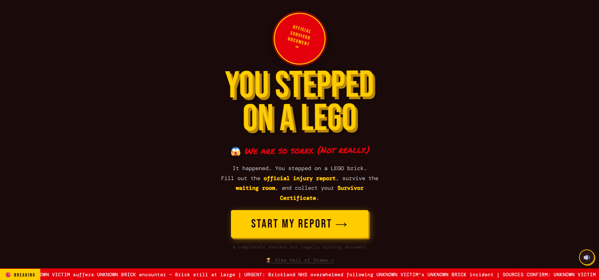
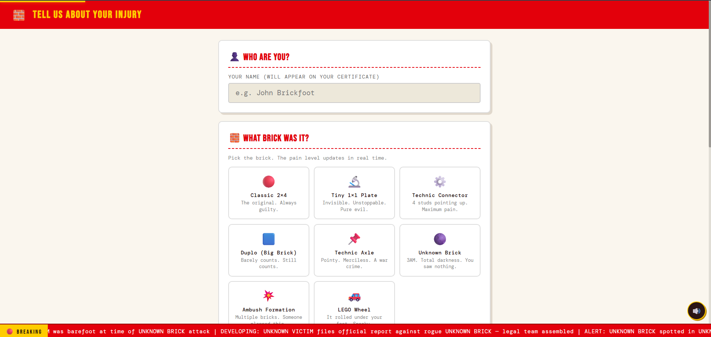
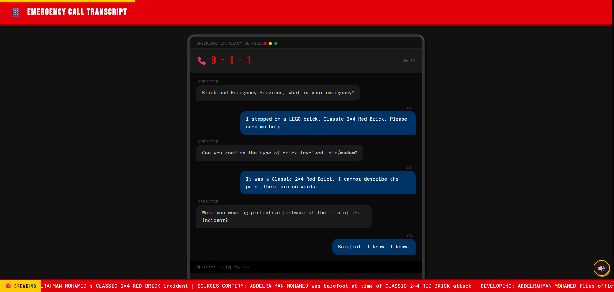
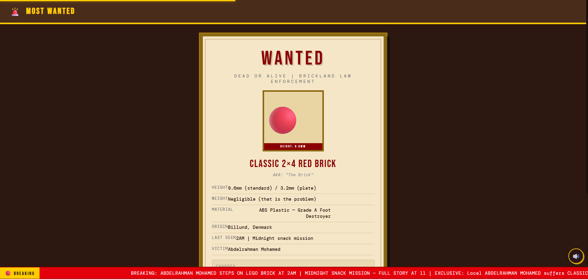
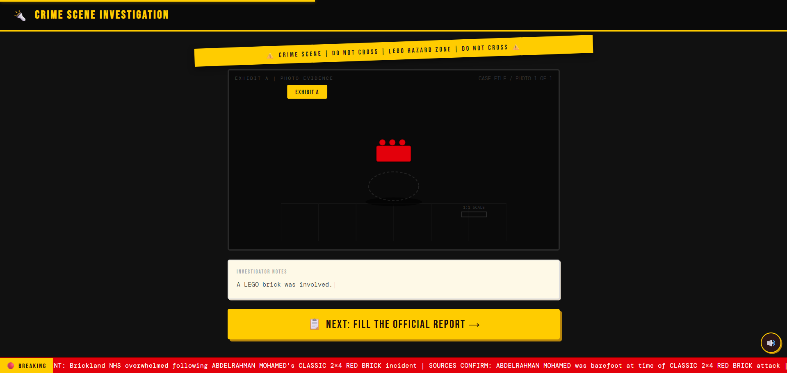
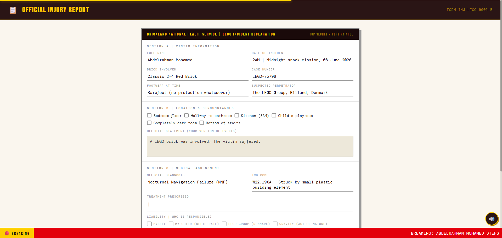
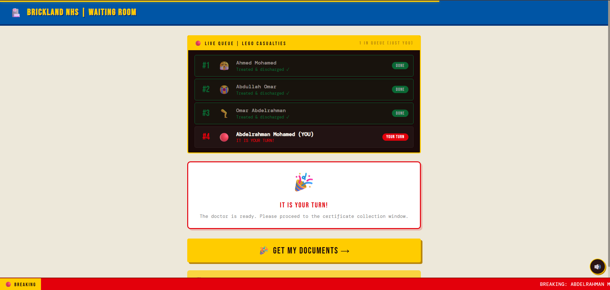

<p align="center">
  
</p>

# LEGO Injury Report

I made this because one day I stepped on a LEGO brick and thought... what if there was an official website to report it?

So instead of sleeping, I spent way too much time making this.

Its just a funny web app where you go through the whole process of reporting your "LEGO injury". Nothing here is serious.

## What is this?

This project is a small web app made with HTML, CSS and JavaScript.

You start by choosing the LEGO brick that attacked you, then you go through different screens like:
- Fake 911 call
- Wanted poster
- Crime scene
- Official report
- Waiting room
- Survivor certificate

Everything is just for fun.

---

## Screenshots

| Screen | Description |
|--------|-------------|
|  | Intro screen |
|  | Choose the brick |
|  | Emergency call |
|  | Wanted poster |
|  | Crime scene |
|  | Report form |
|  | Waiting room |
|  | Survivor certificate |

---

## Features

- 8 different screens
- 8 LEGO brick types
- Different pain levels
- Animated fake 911 conversation
- Crime scene generator
- Wanted posters
- Fake medical report
- Waiting room
- Downloadable survivor certificate
- Achievements
- Hall of Shame leaderboard

---

## Built With

- HTML
- CSS
- JavaScript
- SVG
- Web Audio API
- html2canvas

No frameworks.

---

## How to run

Clone the repo

```bash
git clone https://github.com/abdelrahman-mo7amd/LEGO-Injury.git
cd LEGO-Injury
